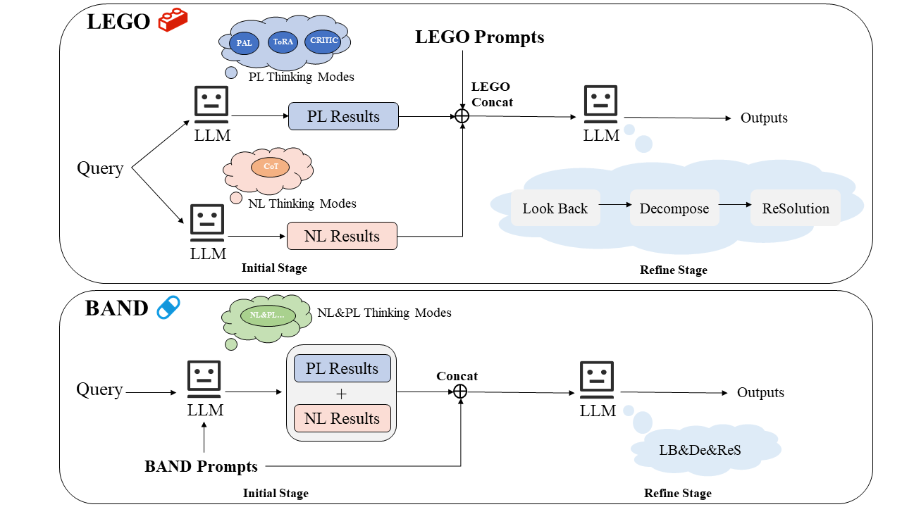
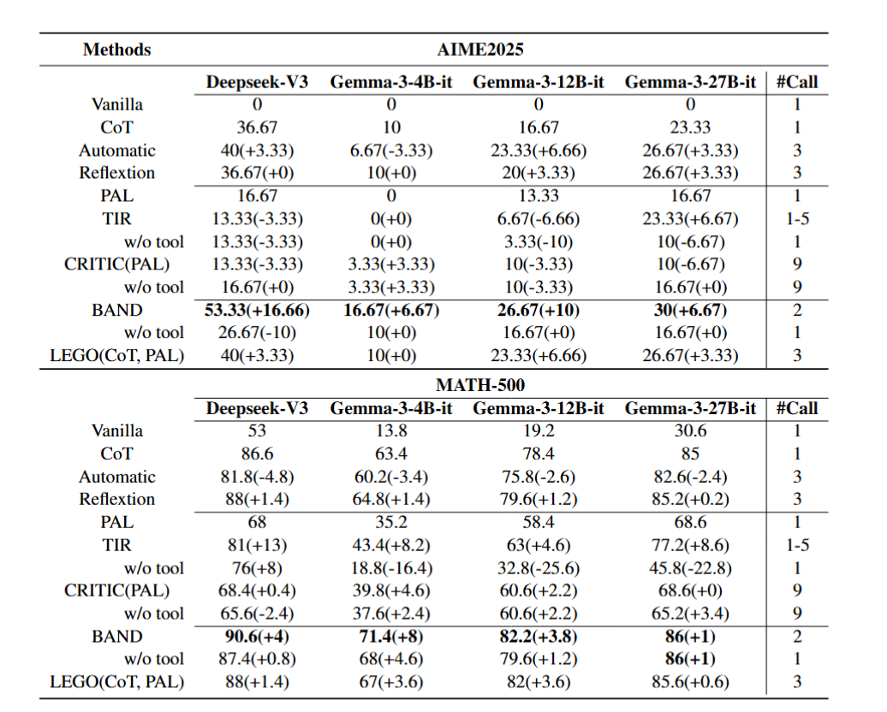

<h1 align="center">💭🙌😊Self-Dual: Enhancing Mathematical Reasoning via Complementary Thinking Modes</h1>

  
  

# 💡 Introduction

The  self-dual framework is designed for solving challenging mathematical reasoning problems by complementary thinking modes.

The Self-Dual framework comprises two stages: (1) generating two diverse reasoning paths using complementary thinking modes, and (2) refining these results through the processes of Look Back, Decomposition, and ReSolution. In BAND, the in-context setting refers to generating PL and NL results within a single prompt, whereas the out-of-context setting involves producing them independently.

# 🔧 Setup

We recommend the use of conda environments:
>conda create --name sdual python=3.9
>
>conda activate sdual
>
>pip install -r requirements.txt

Config Online Deepseek API Keys:
 
- Set up the env variable: `export DEEPSEEK_API_KEY=your api key`.

# 🚀 Quick Start

 We provide example bash scripts  follows:

- CoT: `bash ./scripts/run_cot.sh`
- PAL: `bash ./scripts/run_pal.sh`
- BAND: `bash ./scripts/run_sd_band.sh`

...

You can configure the datasets and models through the provided bash scripts. Note that some methods—such as LEGO, CRITIC, and Auto—depend on the results of baseline methods. Therefore, you must include the corresponding result JSONL files when using these approaches. 

# 🍎 Results

